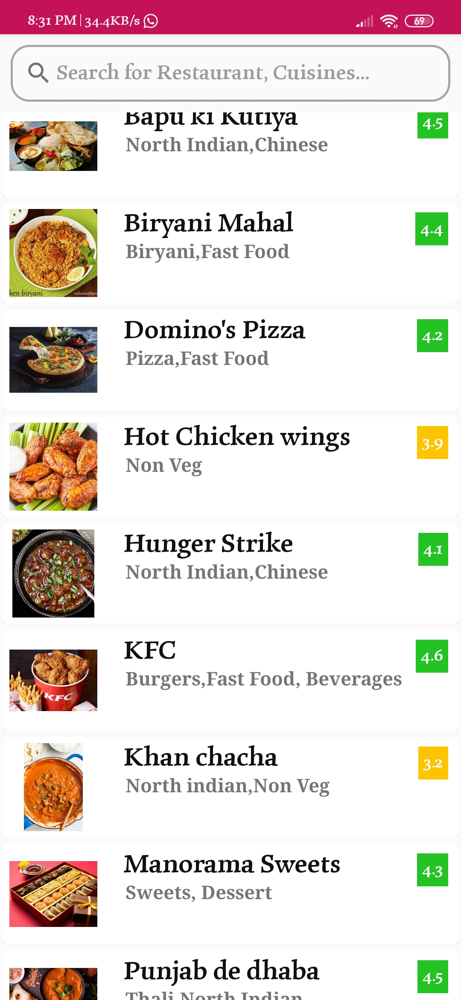

# Zaika-on-wheel
This is a functional demo app which provide the user to register themselves through phone number verification and can facilitate to order food online.
# Replica of UI
    

# Libraries Used
* Picasso : For uploading and fetching image from database.
* Google Material Design : For Material EditText,CardView And TextView.
* Used Circular ImageView

#  Database And Authentication Service Used
* Firebase Realtime Database
* Firebase Authentication
